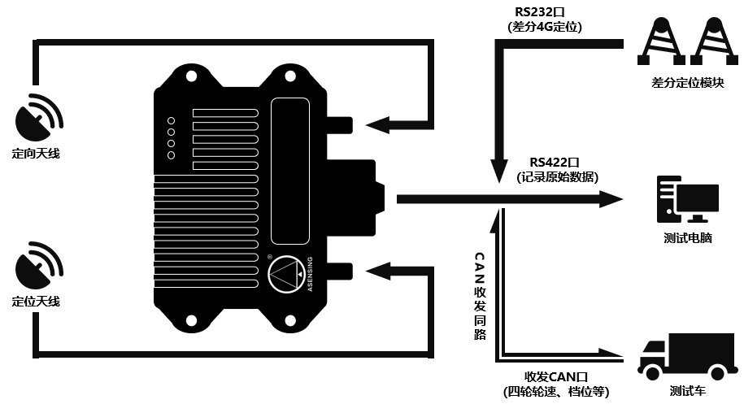

#   Intro
This is the Baidu Apollo gnss driver adapted for using ins570d.

##  About Apollo
A high performance, flexible architecture which accelerates the development, testing, and deployment of Autonomous Vehicles.[Apollo's Github Repo](https://github.com/ApolloAuto/apollo)

##   About ins570d
A High-precision combined navigation device.    [Documentation Here](http://www.asensing.com/p_box)

#   Usage
This is the hardware connecting diagram, to use this driver wo also need a RS422-USB line added between RS422 port and testing PC.

Than run the following commands to clone this repo.
>   git clone https://github.com/Mud-B/ins570d_apollo_driver.git

Next,under this path`/<Apollo_workspace>/modules/driver/gnss`, replace the Apollo origin driver with this driver.

Finally,use this command under apollo docker environment to build driver.
>   ./apollo.sh build_opt driver/gnss